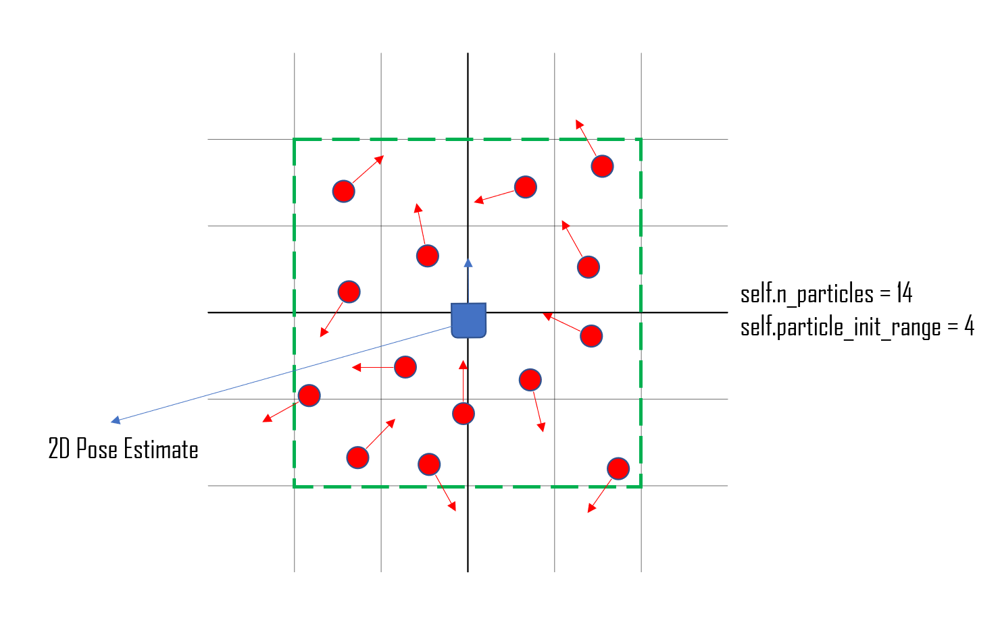
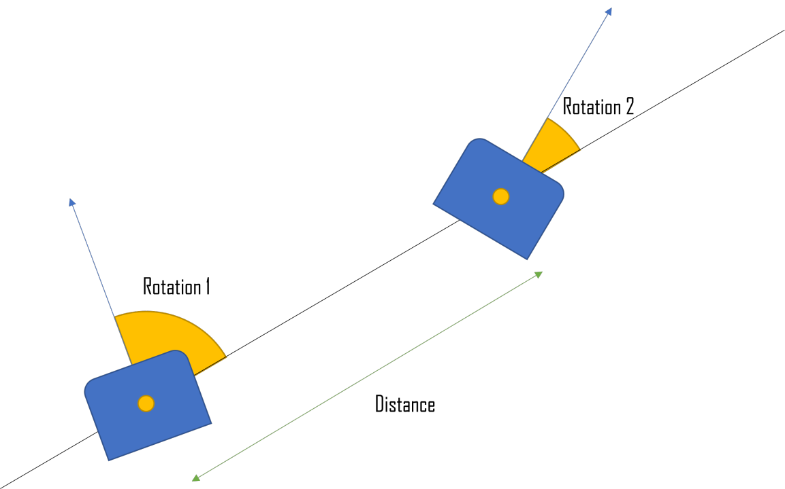
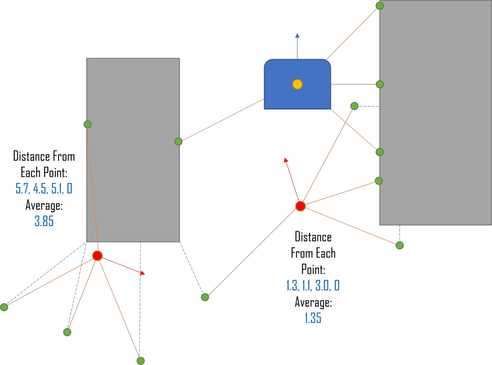
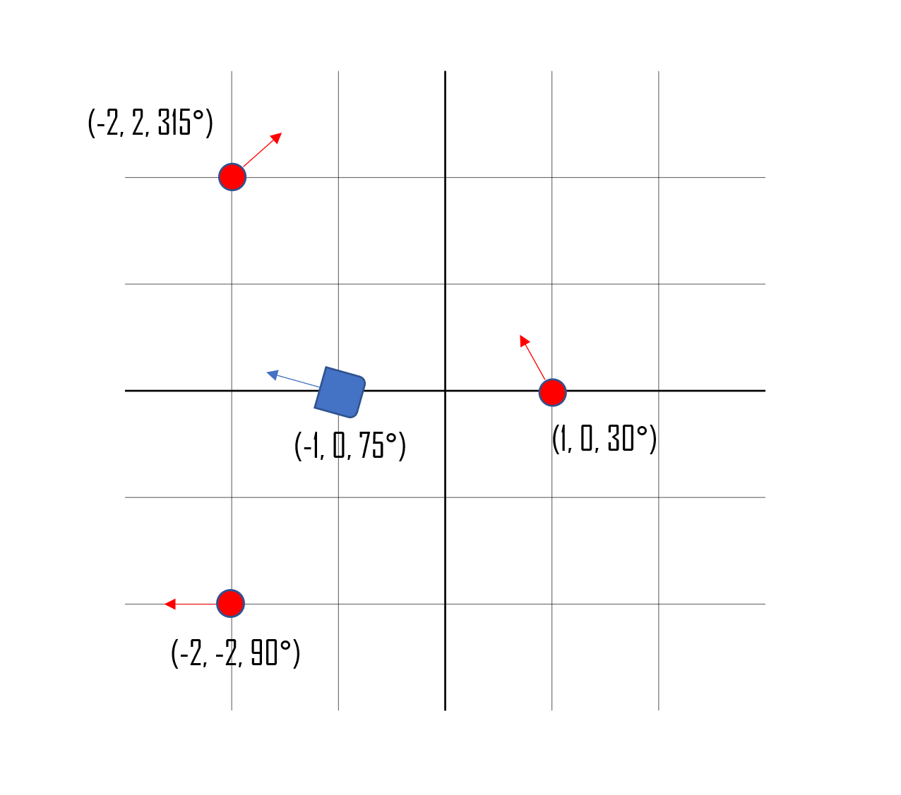
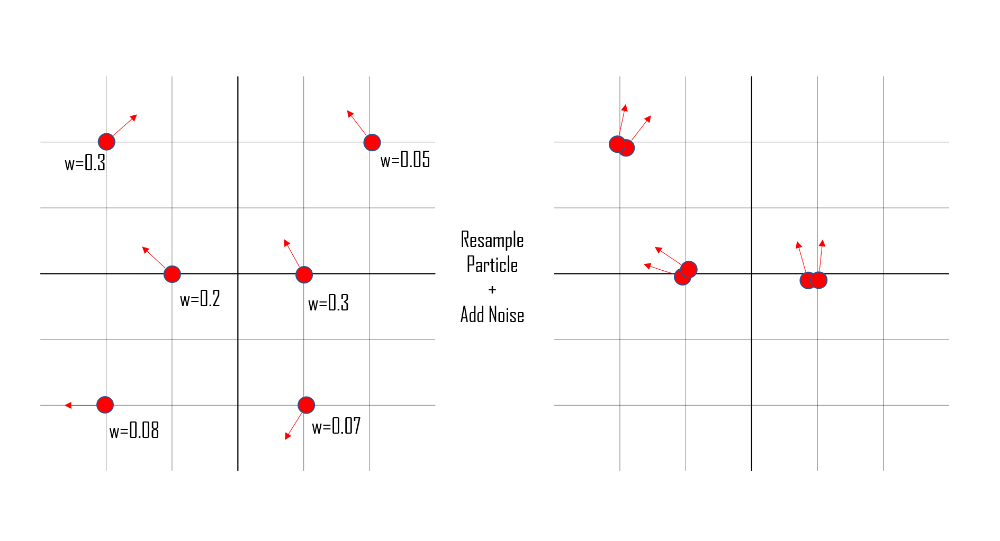

# Robot Localization

## Overview
Robot localization is one of the building blocks of achieving successful robot navigation (perception, localization, cognition, motor control); necessary for making decisions about its future actions. The objective of this project was to use a particle filter to determine where our Neato is located and how it is oriented with respect to its environment, which was a pre-built map of the first floor of the MAC in our case. The particle filter is first initialized with a random distribution of particles, where each particle is a representation of the Neato's potential location and orientation in the map. Once the initialization is done, the following steps are repeated:

1. Update the particles using data from odometry
2. Reweight the particles based on their compatibility with the laser scan
3. Update your estimate of the robot’s pose given the new particles. Update the map to odom transform.
4. Resample with replacement a new set of particles with probability proportional to their weights.

Below is a demonstration of a simulation of the Neato determining its position and orientation in the MAC.

| Bag File | Based On | Demo |
| ------------- | ------------- | ----- |
| [macfirst_take_2](bags/macfirst_take_2) | [macfirst_floor_take_1](bags/macfirst_floor_take_1) | [particle_filter_demo_1](images/particle_filter_demo_1.gif)|
| [mac_take_2](bags/mac_take_2) | [macfirst_floor_take_2](bags/macfirst_floor_take_2) | [particle_filter_demo_2](images/particle_filter_demo_2.gif)|

## Initialize Particles

Before anything, we must initialize particles within the map. Each particle is a representation of the Neato's potential location and orientation on the map. Initialization creates N particles within the defined bounding area from the center given by the 2D Pose Estimate. An example of particle initialization with 14 particles and a bounding box unit of 4 is seen below:

## Update Particle Positions

Once the Neato starts moving around, we must also update the positions of the particles relative to the Neato's movement. In order to do so, we follow the steps below for every particle in the particle cloud:

1. Compute the change in x, y, and theta between the robot's current and previous state in the odom frame
2. Compute the angle of rotation towards the new particle position in the map frame
3. Compute the distance from the previous location to the new location in the (WHAT FRAME?)

A visualization of this process is shown in the picture below:

## Update Particle Weights

As the robot navigates around its environment, it receives laser scan data that consists of 1) distance readings to nearby obstacles and 2) angles relative to the robot frame for each corresponding distance reading. Using this obstacle data over 360 degrees, the weight of each particle in the particle cloud is recalculated. The greater the mean obstacle distance over 360 degrees of a particular particle, the less likely the particle is to be an accurate representation of the Neato in the map. The relationship between the particle weight and the mean obstacle distance reading is represented as an inversely proportional relationship. In case the obstacle location either returns to be a `NaN` or does not fall within the valid boundary of the map, we punish this behavior by assigning a high obstacle distance value, so that the particle weight will decrease. 

## Update Robot Position On Map

Once all the particles are re-weighted, the mean of all the particles' x, y, and theta relative to the map frame is calculated. This mean is set to be the next position of the Neato on the map. An example of this step can be seen below, where the robot position is updated based on the location and orientation of three particles.

## Resample Particles

Once the robot position on the map is updated, we randomly select n (CHECK HERE) particles based on their unlikely probability of the particle being the Neato's actual location and orientation and update those particles with noise. Before randomly drawing a sample of the particles from the `self.particle_cloud`, we made sure to normalize the weights of the particles to use each particle's normalized weight as the probability which the particle is an actual representation of the Neato's location and orientation. The higher the weight of the particle, the more likely the particle is to be a representation of the Neato in the map, and vice versa. Using this probability array, we draw a random sample of particles using `draw_random_sample()`, which most likely results in particles that are less likely to be accurate representations of the Neato in the map. These resampled particles are then clustered closer to particles with higher weights/probabilities with some noise. The distribution of particles before and after resampling is shown in the picture below.

## Conclusion

We found 300 particles to be sufficient to determine the Neato's location in the provided map of the MAC first floor. 

### Challenges

### Improvements

Our current implementation of `update_particles_with_odom()` is a rather crude approach that breaks down frame translation and rotation into smaller steps, resulting in a longer run-time. However, this can be optimized with a more elegant approach of using a combination of rotation matrixes and the Numpy library. This way, the frame translation, and rotation can be easily represented as matrix multiplications. 

### Lessons

One of the big takeaways from working on this project was to test every block (e.g. `update_particles_with_odom()`, `update_robot_pose()`, `resample_particles()`, `update_particles_with_laser()`, `initialize_particle_cloud()`) consisting robot localization. This meant after writing the functionality for each function, not only resolving errors but most importantly testing that the simulation in RViz exhibits the expected behavior. This helped us to guarantee which blocks of the project were working properly and reduced the time narrowing down the areas that would produce undesired behaviors. 

